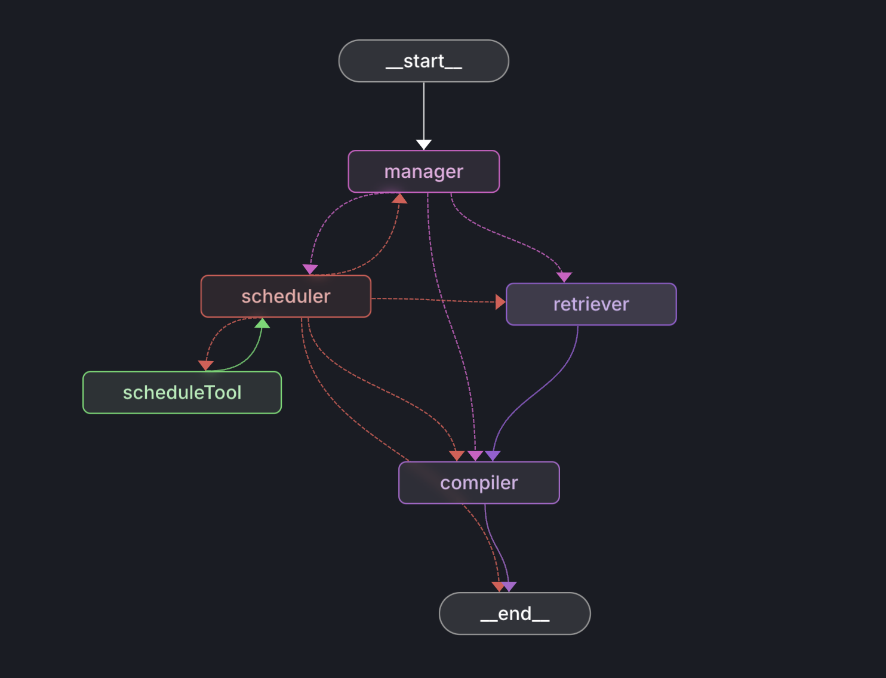

# LangGraph.js Project

This project demonstrates a multi-agent system implemented using [LangGraph.js](https://github.com/langchain-ai/langgraphjs), designed for [LangGraph Studio](https://github.com/langchain-ai/langgraph-studio). The system consists of multiple specialized agents working together to handle automated email campaign responses.



## System Components

The project includes several key components:

1. **Scheduler**: Manages task scheduling and coordination
2. **Manager**: Oversees the workflow and agent interactions
3. **Compiler**: Handles code compilation and processing tasks
4. **State Management**: Maintains system state across interactions

## What it does

The multi-agent system processes and responds to campaign emails by:

1. Analyzing incoming campaign response emails
2. Categorizing the response type (interested, questions, declined, etc.)
3. Generating appropriate personalized replies
4. Maintaining context across email threads
5. Coordinating between different specialized agents for optimal responses

### Email Processing Features

- **Response Analysis**: Intelligently analyzes email content and sentiment
- **Template Management**: Uses customizable templates while maintaining a personal touch
- **Context Awareness**: Maintains conversation history for coherent follow-ups
- **Campaign Tracking**: Monitors response rates and engagement metrics
- **Priority Handling**: Sorts and prioritizes responses based on urgency and potential

## Getting Started

Assuming you have already [installed LangGraph Studio](https://github.com/langchain-ai/langgraph-studio?tab=readme-ov-file#download), to set up:

1. Create a `.env` file with necessary environment variables:

```bash
cp .env.example .env
```

2. Open the folder in LangGraph Studio
3. Configure the agents as needed

## How to customize

1. **Modify Agent Behaviors**: Each agent's behavior can be customized in their respective prompt files under `src/prompts/`
2. **Email Templates**: Customize response templates in `src/templates/`
3. **Response Rules**: Configure response logic and priorities in the workflow
4. **Campaign Settings**: Adjust campaign-specific parameters and rules

You can enhance this system by:

- Creating specialized response templates for different campaign types
- Implementing sentiment analysis for better response categorization
- Adding integration with CRM systems
- Customizing follow-up schedules and rules
- Setting up automated reporting and analytics

## Development

The system supports hot reloading during development. You can:

- Modify agent prompts to adjust their behavior
- Add new nodes to the graph for more complex workflows
- Implement additional state management logic
- Test different agent coordination patterns

For more advanced features and examples, refer to the [LangGraph.js documentation](https://github.com/langchain-ai/langgraphjs).

LangGraph Studio integrates with [LangSmith](https://smith.langchain.com/) for detailed tracing and debugging of multi-agent interactions.

<!--
Configuration auto-generated by `langgraph template lock`. DO NOT EDIT MANUALLY.
{
  "config_schemas": {
    "agent": {
      "type": "object",
      "properties": {}
    }
  }
}
-->
